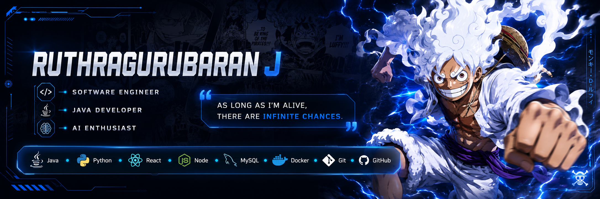

  

<h1 align="center">Hi 👋, I'm Ruthragurubaran J</h1>

<h3 align="center">
Software Engineer • Java Developer • AI Enthusiast
</h3>

  

---

# 👨‍💻 About Me

🎓 **B.Tech Information Technology Student**

💻 Passionate about

- ☕ Java
- 🐍 Python
- 🤖 Artificial Intelligence
- 🧠 Machine Learning
- 🌐 Full Stack Development

🌱 Currently Learning

- 🚀 Spring Boot
- ⚛️ React
- 🐳 Docker
- 🏗️ System Design

⚡ **Goal**

Become a Software Engineer building impactful and scalable applications.

---

# 🚀 Tech Stack

---

# 📊 GitHub Statistics

---

# 🔥 GitHub Streak

---

# 📈 Contribution Graph

---

# 🐍 Contribution Snake

---

# 🏆 GitHub Trophies

---

# 👀 Profile Views

---

# ⭐ Featured Projects

| 🚀 Project | 📄 Description |
|------------|----------------|
| **TerraShield AI** | AI-Based Rockfall Detection for Mining Safety |
| **ExplainFirst** | Teaching Evaluation Platform |
| **Smart Clinic Management** | Java + JDBC + MySQL |
| **Wrong Way Game** | Java Desktop Game |

---

# 🌐 Connect With Me

---

# ⚓ Favorite Quote

> **"If you don't take risks, you can't create a future."**

---

<h3 align="center">

⭐ Thanks for visiting my profile ⭐

Dream • Believe • Build • Never Give Up

</h3>
